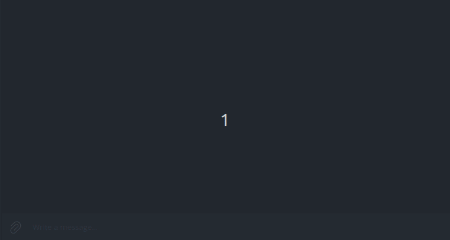

# Auto Complete Form Bot

Installation
------------

Clone a repository

```
git clone https://github.com/vadushkin/AutoCompleteFormBot.git
```

Create ```api/.env``` file or delete ```.example``` from ```api/.env.example```

### Example:

```dotenv
SECRET_KEY=django-insecure-)xd&jyb9wiy+r$xg3%!e4oru3(b66-e#@v=cm31&t4bps00sn7
DEBUG=1
ALLOWED_HOSTS=localhost,127.0.0.1,0.0.0.0,172.17.0.1

CELERY_BROKER_URL=redis://redis:6379
CELERY_BROKER_BACKEND=redis://redis:6379

FORMAT_FOR_SAVING_FILE=%Y-%m-%d_%H-%M
URL_FORM=https://b24-iu5stq.bitrix24.site/backend_test/

SITE_URL=http://172.17.0.1:8001
```

Create ```bot/.env``` file or delete ```.example``` from ```bot/.env.example```

### Example:

```dotenv
TOKEN=YOUR_TOKEN

SERVICE_SITE_URL=http://172.17.0.1:8001
```

`SITE_URL` and `SERVICE_SITE_URL` must be **equal**

To get a host for the variable `SERVICE_SITE_URL`:


[BotFather](https://t.me/BotFather) for `TOKEN`

### Run:

```
docker-compose up --build
```

Example
--------



Function `get_screenshot` preparing about 15-20 seconds
